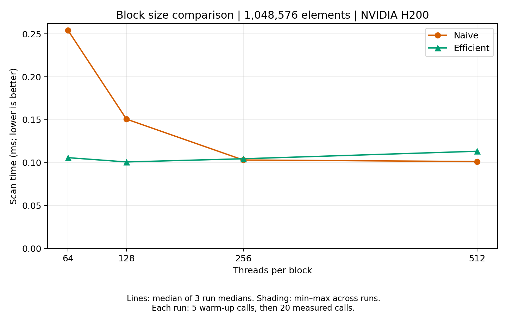
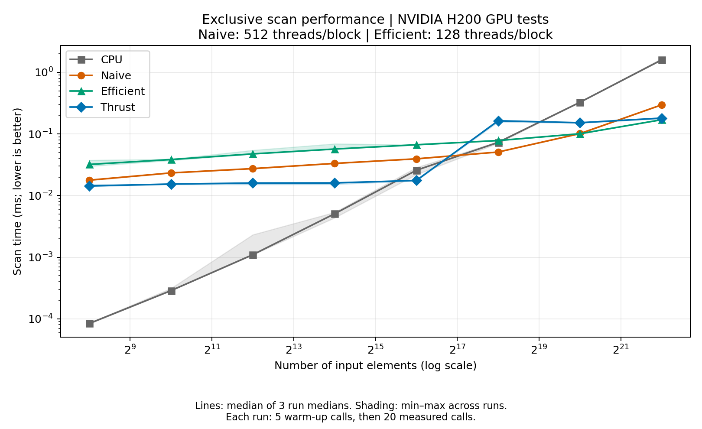
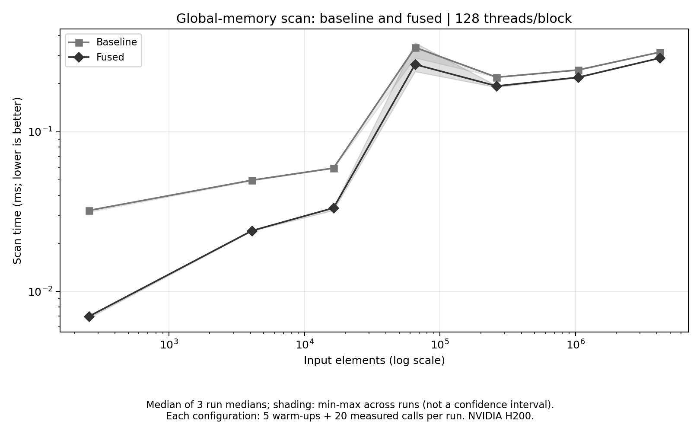
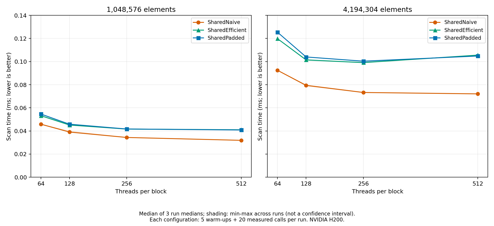
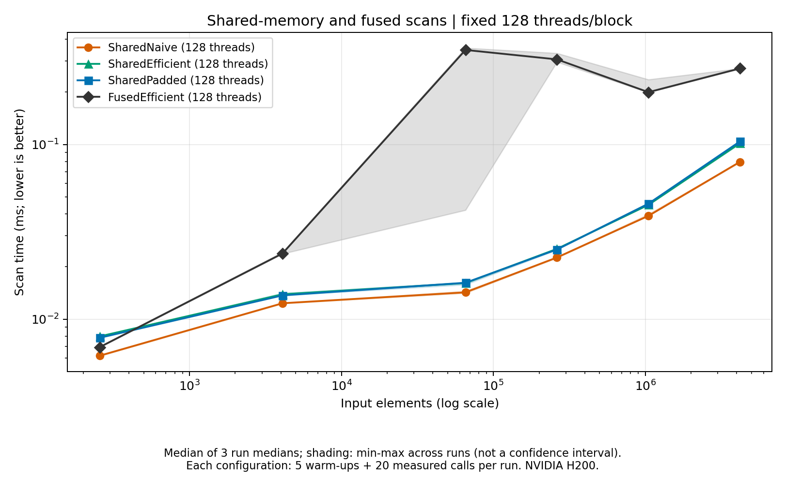

CUDA Stream Compaction
======================

**University of Pennsylvania, CIS 565: GPU Programming and Architecture, Project 2**

- Qingying Li
  - [LinkedIn](https://www.linkedin.com/in/harper-li-292730373/)
- Tested on: NVIDIA H200 server, Ubuntu 22.04 Docker container, CUDA Toolkit 12.4, CMake 3.22.1.
- GPU benchmarks were compiled with optimization enabled and targeted `sm_90`.

### Implementation

This project implements exclusive prefix sum and stream compaction.

The four base scan implementations are:

- **CPU:** A sequential loop that keeps a running sum.
- **Naive:** A GPU scan that adds values from increasing offsets using two alternating buffers.
- **Efficient:** A work-efficient GPU scan with up-sweep and down-sweep phases. Non-power-of-two inputs are padded with zeros.
- **Thrust:** A scan using `thrust::exclusive_scan`.

Stream compaction removes zeros while keeping the remaining elements in
their original order. The CPU implementation includes a direct version
and a version using the map, scan, and scatter steps. GPU compaction
uses the work-efficient scan.

### Correctness Tests

The provided tests passed for power-of-two and non-power-of-two inputs,
including arrays with 1,048,576 and 1,048,573 elements.

Additional tests covered empty arrays, single elements, all-zero inputs,
negative values, and lengths around thread-block boundaries.

The extra tests compared scan results with `std::exclusive_scan` and
compaction results with `std::copy_if`. All 98 checks passed.

An excerpt from the provided test output is shown below:

~~~text
==== naive scan, power-of-two ====
    passed
==== naive scan, non-power-of-two ====
    passed
==== work-efficient scan, power-of-two ====
    passed
==== work-efficient scan, non-power-of-two ====
    passed
==== thrust scan, power-of-two ====
    passed
==== thrust scan, non-power-of-two ====
    passed
==== work-efficient compact, power-of-two ====
    passed
==== work-efficient compact, non-power-of-two ====
    passed
~~~

### Benchmark Method

CPU scans were measured with the CPU timer, and GPU scans were measured
with CUDA events. Initial GPU memory allocation and input/output
transfers were outside the GPU timing interval. Work performed inside
the scan call, including Thrust's internal allocation, remained timed.

Each configuration used 5 warm-up calls followed by 20 measured calls.
The experiment was repeated three times.

Each plotted point is the median of the three run medians. Shading
shows the minimum and maximum of those three values.

Raw data and the plotting script are saved in `results/`.

### Block Size



This experiment used 1,048,576 elements and tested 64, 128, 256, and
512 threads per block. Lower time is better.

| Threads per block | Naive (ms) | Efficient (ms) |
|---|---:|---:|
| 64 | 0.254176 | 0.105728 |
| 128 | 0.150656 | 0.100752 |
| 256 | 0.103008 | 0.104448 |
| 512 | 0.101232 | 0.113200 |

Naive improved as the block size increased, although the difference
between 256 and 512 was small. Efficient was fastest at 128 threads
per block and became slightly slower with larger blocks.

The array-size comparison used 512 threads per block for Naive
and 128 for Efficient, based on the block-size experiment.

### Array Size



This experiment tested arrays from 256 to 4,194,304 elements.
Both axes use logarithmic scales, and lower time is better.

CPU scan was fastest for small inputs. Small GPU tasks still need
kernel launches and synchronization, so parallel execution did not
provide an advantage at those sizes.

Naive was faster than Efficient for several smaller sizes. Although
Efficient performs less total work, its up-sweep and down-sweep require
more kernel launches. At larger sizes, reducing the total work becomes
more useful.

At 4,194,304 elements, the measured times were:

| Implementation | Scan time (ms) |
|---|---:|
| CPU | 1.593361 |
| Naive | 0.296864 |
| Efficient | 0.170128 |
| Thrust | 0.180624 |

Efficient was fastest at this size, with about 1.74 times the speed of
Naive within the measured timing intervals.

GPU timings exclude initial and final CPU–GPU data transfers.

### Thrust Profiling

Thrust was fast for smaller inputs, but its measured time increased
sharply between 65,536 and 262,144 elements.

Nsight Systems showed one allocation, two kernel launches, one stream
synchronization, and one deallocation inside each timed Thrust scan.

| CPU API operation | 65,536 elements (µs) | 262,144 elements (µs) |
|---|---:|---:|
| Allocation | 1.45 | 73.28 |
| Deallocation | 2.85 | 82.18 |

These values are median CPU API durations per measured scan.
The main scan kernel's average GPU execution time increased only
from about 3.23 to 4.33 microseconds.

This suggests that temporary-memory management contributed to the
increase in scan time. The trace does not establish the exact reason
the allocation and deallocation became slower.

Nsight adds profiling overhead, so the performance graphs use the
separate measurements collected without profiling.

The profiling summary is saved in `results/nsight/scan-analysis.txt`.

### Build Notes

A typo in `stream_compaction/CMakeLists.txt` was corrected:
`stream_compaction}` was changed to `stream_compaction` in the
`set_target_properties` call.

The project was built with:

~~~bash
cmake -S . -B build \
    -DCMAKE_BUILD_TYPE=Release \
    -DCMAKE_CUDA_COMPILER=/usr/local/cuda/bin/nvcc \
    -DCMAKE_CUDA_FLAGS="-arch=sm_90"

cmake --build build -j2

./build/bin/cis5650_stream_compaction_test
~~~

The `sm_90` setting targets the H200 used for these experiments.

### Extra Credit

The earlier performance figures show the original implementation. The following results cover the extra-credit versions.

#### Work-Efficient Scan Optimization

The global-memory scan assigns threads to active tree nodes and reduces the number of blocks at each upsweep level. The fused version also combines the upper levels, root reset, and corresponding downsweep levels into one kernel once the active nodes fit in a single block. Threads synchronize between levels.

Both the baseline and fused versions use active-node indexing, so this comparison measures the additional effect of fusion. At 1,048,576 elements and 128 threads per block, fusion reduces the scan from 41 kernel launches to 25.



| Elements | Baseline (ms) | Fused (ms) | Time reduction |
| --- | ---: | ---: | ---: |
| 256 | 0.032128 | 0.006976 | 78.3% |
| 1,048,576 | 0.243584 | 0.219008 | 10.1% |

The benefit was larger for small arrays, where kernel launch overhead can be a large part of the total time. At 65,536 elements, timings varied considerably and the fused version was slower in one run. The updated implementation passed all 98 existing edge checks.

#### Radix Sort

The new `RadixSort` module sorts signed 32-bit integers using 32 least-significant-bit passes. Each pass marks zero bits, scans those flags using the project's own `Efficient::scanDevice`, and scatters values into zero-bit and one-bit groups while preserving their order. Flipping the sign bit when forming the sort key puts negative values before nonnegative values.

Example:

```cpp
#include "stream_compaction/radix_sort.h"

int input[] = {5, -3, 0, 128, 5, 7, -1000, 2};
int output[8];
StreamCompaction::RadixSort::sort(8, output, input);
```

```text
Sorted output: -1000 -3 0 2 5 5 7 128
ALL RADIX SORT TESTS PASSED
```

All 21 tests passed against `std::sort`, including empty inputs, negative values, repeated keys, integer limits, and arrays of up to 1,048,576 elements.

#### Shared-Memory Scan

Three versions were added based on [GPU Gems 3, Chapter 39](https://developer.nvidia.com/gpugems/gpugems3/part-vi-gpu-computing/chapter-39-parallel-prefix-sum-scan-cuda):

- **SharedNaive:** double-buffered shared-memory scan based on Example 39.1.
- **SharedEfficient:** shared-memory upsweep and downsweep based on Example 39.2.
- **SharedPadded:** the same tree scan with padding intended to reduce bank conflicts, following the approach in Section 39.2.3.

Each block processes two elements per thread. For larger arrays, all three versions scan block totals using the existing fused global-memory scan, then add the resulting offsets to each block's output. Partial tiles are filled with zeros. All 192 checks passed across four block sizes, including tile boundaries, negative values, and million-element inputs.

Shared memory is allocated dynamically. With B threads, SharedNaive uses 4B integers and SharedEfficient uses 2B. The padded version maps index i to `i + (i >> 5) + (i >> 10)` and allocates space for the extra entries. Larger blocks increase shared-memory usage per block and change the number of tiles. These resource requirements can affect occupancy, but occupancy and bank-conflict counters were not measured here.



At 1,048,576 elements, 512 threads per block gave the lowest median time for each shared-memory version. At 4,194,304 elements, SharedNaive was fastest with 512 threads, while SharedEfficient and SharedPadded were fastest with 256. A larger block was therefore not always better.



The array-size graph holds all versions at 128 threads per block. At 4,194,304 elements:

| Version | Median scan time (ms) |
| --- | ---: |
| FusedEfficient | 0.272272 |
| SharedNaive | 0.079472 |
| SharedEfficient | 0.101504 |
| SharedPadded | 0.104000 |

SharedNaive was fastest here, even though it performs more additions per tile. Its simpler scan structure may help, but these timings alone do not explain the difference.

Padding did not give a consistent improvement. At 4,194,304 elements and 512 threads, it reduced the median from 0.105600 to 0.104816 ms, about 0.7%. With 64 threads, it increased the median from 0.119824 to 0.125408 ms, about 4.7%.

#### Extra Credit Benchmark Method

Both experiments used optimized builds targeting `sm_90` on the NVIDIA H200. Each configuration had five warm-up calls and 20 measured calls, repeated in three runs with changing configuration order. Reported values are medians of the three run medians. Shading shows the minimum and maximum run medians, not confidence intervals. Every benchmark call was checked against a CPU reference outside the timed interval.

CUDA event timing excludes input/output host-device transfers and buffer allocation. Shared-scan timing includes tile scans, the block-total scan, and offset addition. The fusion experiment and shared-memory experiment were separate runs; their absolute times should not be treated as interchangeable. In the shared-memory experiment, FusedEfficient at 65,536 elements ranged from 0.042112 to 0.356864 ms. The cause of this variation was not isolated.

Benchmark data and test logs are available in `results/extra-credit/`.

#### Additional Build Changes

The radix-sort and shared-scan modules were added to the `stream_compaction` library in its CMake file. The extra tests are compiled separately against that library:

```bash
cmake --build build -j2

for test in radix_sort_tests shared_scan_tests; do
    /usr/local/cuda/bin/nvcc -std=c++17 -O3 -arch=sm_90 \
        -I. tests/$test.cu build/lib/libstream_compaction.a \
        -o build/bin/$test
    ./build/bin/$test
done
```